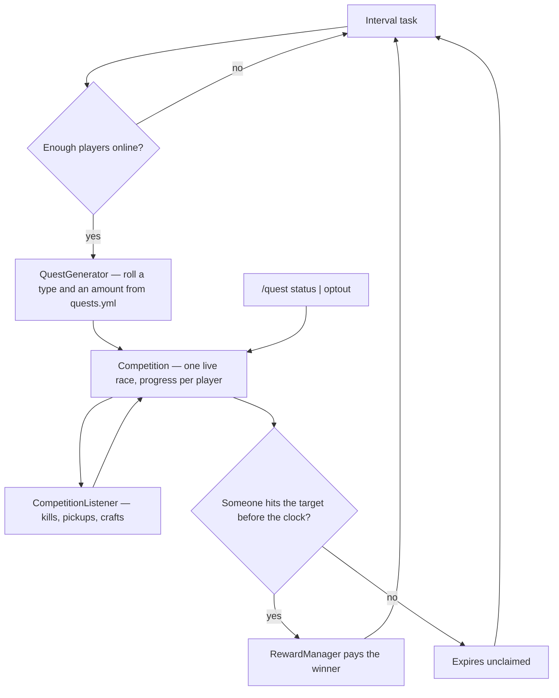

<h1 align="center">MicroQuests</h1>

<p align="center">
  <b>Short server-wide quest races where the whole server chases one objective.</b>
</p>
<p align="center">
  Everyone online gets the same quest at the same moment — kill, gather, or craft — and the<br />
  first to finish takes the reward. Nobody signs up, and anyone who would rather not can opt out.
</p>

<p align="center">
  
  
  
  
  
</p>

<br />

## Why MicroQuests

A quest plugin usually asks a player to go and find it: open a menu, accept a task, track it alone, turn it in. That works for the handful of people already looking for something to do and does nothing for everyone else. MicroQuests puts one objective in front of every player at once and makes it a race — a few minutes, one winner, no signup — so the thing that pulls a server together is the quest running right now rather than a board somebody has to remember to visit.

<table width="100%">
  <tr>
    <td width="50%" valign="top">
      <h3 align="center">Starts on its own</h3>
      <p align="center">A competition begins once enough players are online, runs on a clock, and expires unclaimed if nobody finishes — no staff member has to kick it off.</p>
    </td>
    <td width="50%" valign="top">
      <h3 align="center">Rolled from your pools</h3>
      <p align="center">Quest types, the eligible mobs and items, and the amount range for each all come out of <code>quests.yml</code>, so what the server chases is yours to set.</p>
    </td>
  </tr>
</table>

<br />

## Stack

| Layer | Technology |
| :--- | :--- |
| Language | Java 17 bytecode |
| Server API | paper-api 1.21.5 (`api-version: 1.21`) |
| Build | Maven with `maven-shade-plugin` |
| Bundled | CoreAPI 1.1.0, UpdaterAPI 1.0.0, bStats 3.0.2 |
| Optional hooks | Vault — soft dependency |

## Requirements

- Paper or Spigot, Minecraft 1.21 through 26.2
- Java 17 or newer

## Getting started

Drop the jar into your server's `plugins` folder and restart. The plugin writes `config.yml`, `messages.yml`, and `quests.yml` into `plugins/MicroQuests/` on first start.

Published on Spigot: <https://www.spigotmc.org/resources/124181/>

## Commands

| Command | Purpose |
| :--- | :--- |
| `/quest status` | Show the active competition and the time remaining. |
| `/quest optout` | Toggle your participation. |

## Configuration

`config.yml`:

| Key | Does |
| :--- | :--- |
| `min-players` | Online players required before a competition starts. |
| `max-quest-time` | Seconds before an unfinished competition expires. |
| `rewards.on-victory` | Console commands run for the winner, with `{player}`, `{quest}`, and `{amount}` placeholders. |
| `rewards.fallback` | XP, items, and potion effects granted when no victory commands are configured. Amounts accept a number or a `min-max` range rolled per win. |

`quests.yml` holds the quest pools: the eligible mobs and items per quest type and the amount range for each. Invalid entries are logged and skipped.

All player-facing text lives in `messages.yml` and supports `&` color codes.

## Permissions

| Node | Default | Grants |
| :--- | :--- | :--- |
| `microquests.update.notify` | op | Receive update notifications. |

## Architecture



## How it works

- **Nobody starts it.** A repeating task opens a competition once enough players are online, and the same task picks up again after one is won or expires — there is no command a staff member has to remember.
- **The quest is rolled, not authored.** `QuestGenerator` picks a type from `kill_quests`, `gather_quests`, or `craft_quests` in `quests.yml` and an amount from that entry's range, so the pool of what the server can be asked to do is entirely config.
- **Everyone is entered by default.** Progress is scored from events every player is already generating — mob kills, item pickups, crafts — so the race needs no signup; `/quest optout` is how a player leaves it.
- **One winner, then it closes.** The first player to reach the target takes the reward and the competition ends immediately; if the clock runs out first it expires unclaimed and nothing is paid.

## Project structure

```
microquests/
└── src/main/java/com/trenton/microquests/
    ├── MicroQuests.java                      Plugin entry and CoreAPI bootstrap
    ├── commands/QuestCommand.java            /quest status and /quest optout
    ├── managers/                             Competition lifecycle, config, rewards
    ├── competition/
    │   ├── Competition.java                  One running race and its progress
    │   ├── QuestGenerator.java               Rolls a quest out of the configured pools
    │   └── quests/                           Kill, Gather, and Craft objectives
    └── listeners/CompetitionListener.java    Scores kills, pickups, and crafts
```

## Building

The plugin depends on two libraries that install to your local Maven repository:

```bash
git clone https://github.com/bradley-t-t/coreapi && mvn -f coreapi install
git clone https://github.com/bradley-t-t/updaterapi && mvn -f updaterapi install
```

Then build the plugin jar:

```bash
mvn package
```

The shaded jar lands in `target/`.

## License

Copyright (c) 2026 Trenton Taylor. All rights reserved.

<br />

<p align="center">
  <sub>One objective, everybody at once, first one home wins.</sub>
</p>
